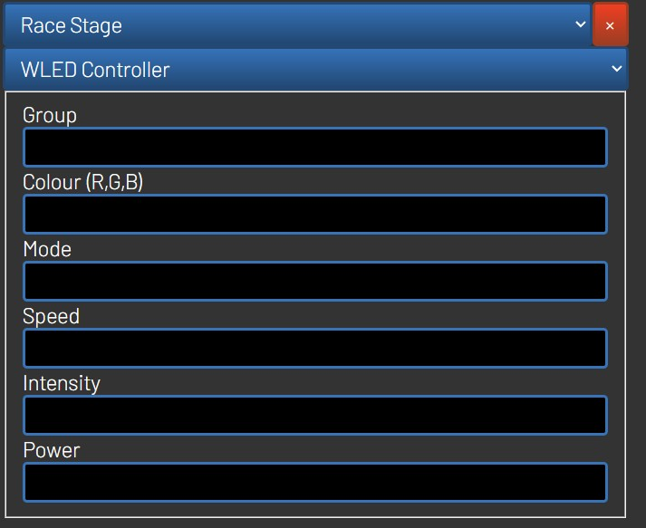

This plugin allows RotorHazard to connect to WLED device on your network and issue commands when events takes place.

To learn more about WLED devices see: https://kno.wled.ge/

Settings:  
WLED Setup is available in the settings tab.  
You will need to enter the ip of each of the wled devices on your network, comma separated.  
You can assign the device a group number by preceeding the ip with group#: 
e.g. 1:192.168.1.100,1:192.168.1.104,2:192.168.1.103 

If no group number is assigned then it will default to group 1

Event Actions:

Assign a group action when an event happens.  
Group - Group number of the group of wled devices to instruct  
Colour - comma separated rgb code for the colour  
Mode - see list below  
Speed - 0-255 is the speed of the effect if valid  
Intensity - 0-255 is the intensity of the effect if valid  
Power - 1 or 0 for on or off  

MODES
0: "Solid"  
1: "Blink"  
2: "Breathe"  
3: "Wipe"  
4: "Wipe Random"  
5: "Random Colors"  
6: "Sweep"  
7: "Dynamic"  
8: "Colorloop"  
9: "Rainbow"  
10: "Scan"  
11: "Dual Scan"  
12: "Fade"  
13: "Theater Chase"  
14: "Theater Chase Rainbow"  
15: "Running Lights"  
16: "Saw"  
17: "Twinkle"  
18: "Dissolve"  
19: "Dissolve Random"  
20: "Sparkle"  
21: "Flash Sparkle"  
22: "Hyper Sparkle"  
23: "Strobe"  
24: "Strobe Rainbow"  
25: "Mega Strobe"  
26: "Blink Rainbow"  
27: "Android"  
28: "Chase"  
29: "Chase Random"  
30: "Chase Rainbow"  
31: "Chase Flash"  
32: "Chase Flash Random"  
33: "Chase Rainbow White"  
34: "Colorful"  
35: "Traffic Light"  
36: "Sweep Random"  
37: "Running Color"  
38: "Running Red Blue"  
39: "Running Random"  
40: "Larson Scanner"  
41: "Comet"  
42: "Fireworks"  
43: "Rain"  
44: "Tetrix"  
45: "Fire Flicker"  
46: "Gradient"  
47: "Loading"  
48: "Rolling Ball"  
49: "Fairy"  
50: "Two Dots"  
51: "Fairytwinkle"  
52: "Running Dual"  
53: "Halloween"  
54: "Chase 3"  
55: "Tri Wipe"  
56: "Tri Fade"  
57: "Lightning"  
58: "ICU"  
59: "Multi Comet"  
60: "Scanner Dual"  
61: "Stream"  
62: "Oscillate"  
63: "Pride 2015"  
64: "Juggle"  
65: "Palette"  
66: "Fire 2012"  
67: "Colorwaves"  
68: "BPM"  
69: "Fill Noise"  
70: "Noise 1"  
71: "Noise 2"  
72: "Noise 3"  
73: "Noise 4"  
74: "Colortwinkles"  
75: "Lake"  
76: "Meteor"  
77: "Smooth Meteor"  
78: "Railgun"  
79: "Ripple"  
80: "Twinklefox"  
81: "Twinklecat"  
82: "Halloween Eyes"  
83: "Solid Glitter"  
84: "Sunset"  
85: "Splash"  
86: "Spellbound"  
87: "Solid Pattern"  
88: "Candle"  
89: "Fireworks Starburst"  

